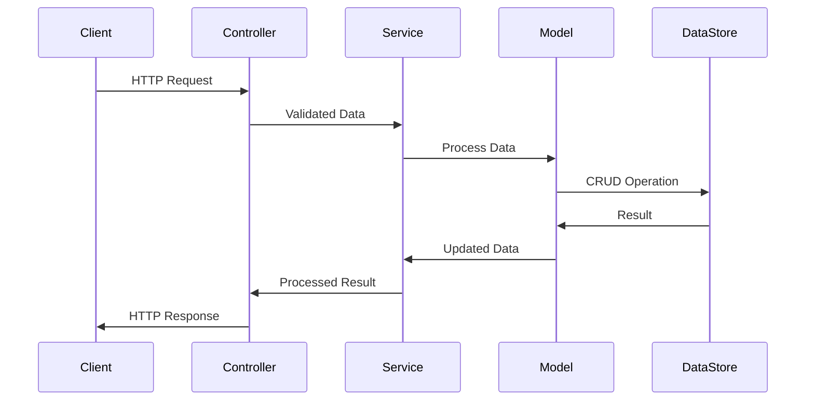
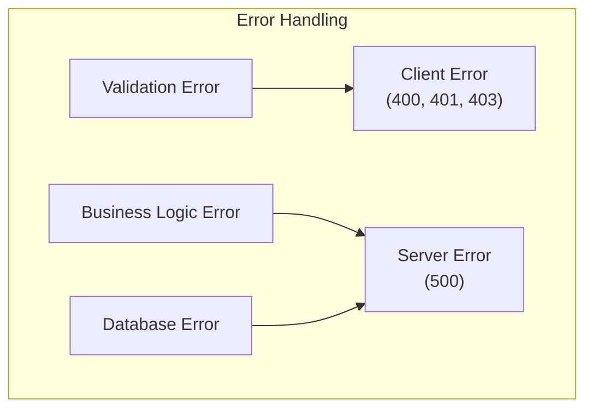

# User Management System Architecture

This document describes the architectural design of the user management system.

## System Overview

The following diagram illustrates the high-level architecture of the system:

```mermaid
graph TD
    subgraph "Client Layer"
        "Client" --> "API Routes"
    end

    subgraph "API Layer"
        "API Routes" --> "Controllers"
        "Controllers" --> "Services"
    end

    subgraph "Service Layer"
        "Services" --> "Models"
    end

    subgraph "Data Layer"
        "Models" --> "Data Store"
    end
```

## Component Descriptions

### Client Layer
- **Client**: Web browsers or API clients that make HTTP requests to the system.
- **API Routes**: Express.js routes that define the HTTP endpoints.

### API Layer
- **Controllers**: Handle HTTP request/response cycle and input validation [^5]
- **Services**: Implement business logic and data manipulation [^1]

### Service Layer
- **Models**: Define data structure and validation rules [^5]
- **Business Logic**: Handle complex operations and enforce business rules

### Data Layer
- **Data Store**: Persistent storage for user data

## Data Flow

1. Client sends HTTP request
2. API route handles request routing
3. Controller validates input and calls appropriate service
4. Service processes request using models
5. Model interacts with data store
6. Response flows back through the layers

## Component Interactions



## Error Handling

Errors are handled at appropriate layers:
- **API Layer**: HTTP status codes, input validation
- **Service Layer**: Business logic errors
- **Data Layer**: Database errors



## Security

The system implements several security measures:
- Input validation at the controller level
- Data sanitization before storage
- Role-based access control
- Error message sanitization

## Performance Considerations

- Connection pooling for database operations
- Request validation early in the request cycle
- Efficient data structures for user objects
- Proper indexing of frequently queried fields

## Monitoring and Logging

Key metrics to monitor:
- Request response times
- Error rates
- Database operation latency
- API endpoint usage statistics

## Future Improvements

Planned enhancements:
1. Caching layer for frequently accessed data
2. Rate limiting for API endpoints
3. Enhanced monitoring and alerting
4. Additional authentication methods