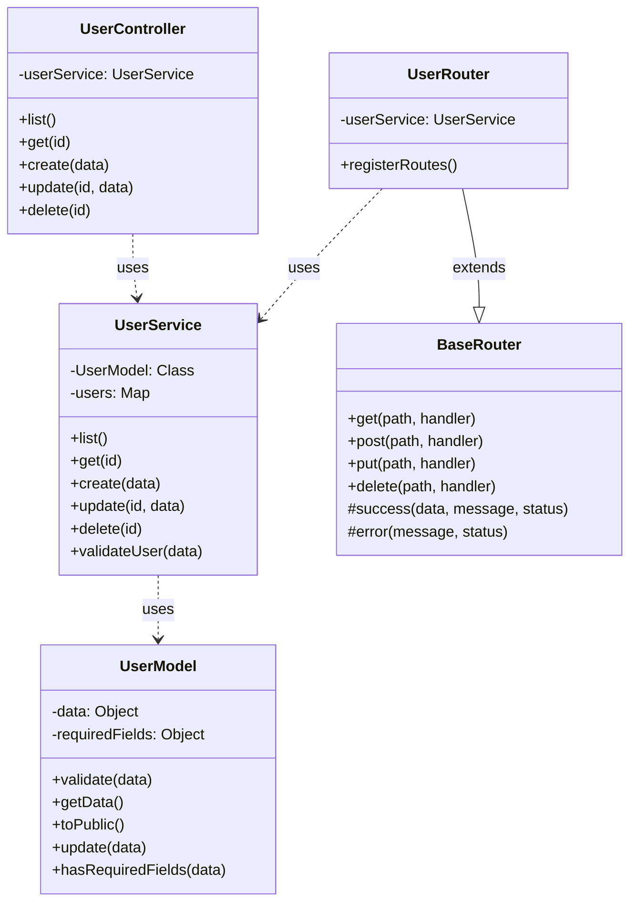
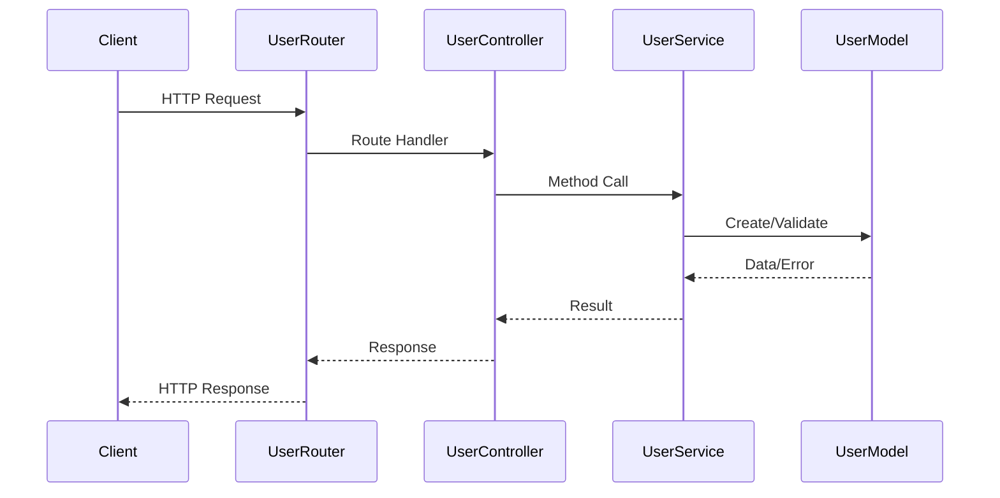
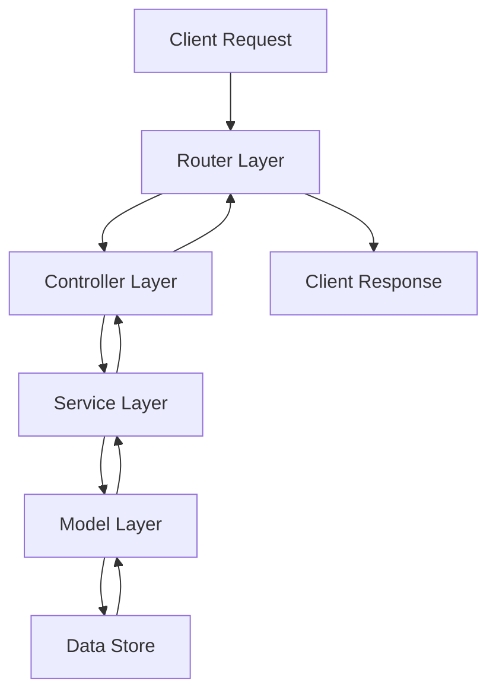

# User Management System Architecture

## Overview
This document describes the architecture and component interactions of the user management system.

## System Architecture

## Component Responsibilities

### UserRouter
- Extends BaseRouter for common routing functionality
- Registers user-specific routes
- Maps HTTP endpoints to service methods
- Handles request/response formatting
- Validates request data

### UserController
- Coordinates request flow
- Validates input data
- Calls appropriate service methods
- Formats response data
- Handles error cases

### UserService
- Implements business logic
- Manages data operations
- Validates business rules
- Handles user data transformations
- Encapsulates storage operations

### UserModel
- Defines user data structure
- Validates data format
- Provides data access methods
- Handles data transformations
- Ensures data consistency

## Request Flow

## Error Handling

The system implements layered error handling:

1. **Model Layer**
   - Data validation errors
   - Format validation
   - Required field checks

2. **Service Layer**
   - Business rule validation
   - Operation errors
   - Data consistency checks

3. **Controller Layer**
   - Input validation
   - Request formatting
   - Error transformation

4. **Router Layer**
   - HTTP error codes
   - Error response formatting
   - Error logging

## Data Flow

## Security Considerations

1. **Authentication**
   - Token-based authentication
   - Session management
   - Role-based access

2. **Data Validation**
   - Input sanitization
   - Type checking
   - Format validation

3. **Error Handling**
   - Safe error messages
   - Error logging
   - Rate limiting

4. **Data Protection**
   - Password hashing
   - Data encryption
   - Sensitive data masking

## Scalability

The system is designed for scalability through:

1. **Modularity**
   - Separated concerns
   - Independent components
   - Pluggable architecture

2. **Stateless Design**
   - No shared state
   - Independent requests
   - Cacheable responses

3. **Performance**
   - Efficient data structures
   - Optimized queries
   - Response caching

## Testing Strategy

Each layer has its own testing requirements:

1. **Unit Tests**
   - Model validation
   - Service methods
   - Controller logic

2. **Integration Tests**
   - API endpoints
   - Service interactions
   - Data flow

3. **End-to-End Tests**
   - User workflows
   - Error scenarios
   - Edge cases